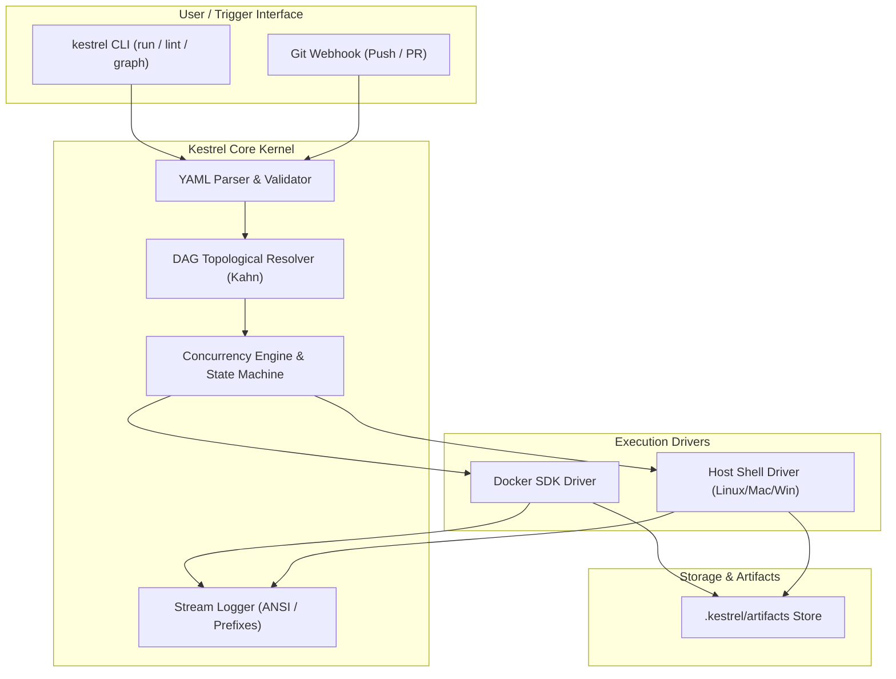

<p align="center">
  
</p>

<h1 align="center">🦅 Kestrel</h1>

<p align="center">
  <strong>A lightweight, razor-sharp cloud-native CI/CD engine built with Go.</strong>
</p>

<p align="center">
  <a href="https://github.com/glorch/Kestrel/actions"></a>
  <a href="https://golang.org"></a>
  <a href="LICENSE"></a>
  <a href="https://github.com/glorch/Kestrel/releases"></a>
</p>

---

## 📖 Introduction

**Kestrel** (红隼) is a modern, fast, and un-bloated CI/CD workflow orchestrator and runner. 

Designed to be both an effortless local execution engine (run pipelines locally before pushing to Git) and an extensible distributed execution plane, Kestrel combines **DAG topological concurrency**, **containerized isolation**, and **streamlined developer ergonomics**.

---

## ✨ Key Features

- **⚡ Zero Overhead & Instant Startup**: Single static Go binary without heavy runtimes (no Java JVM, no Python virtualenvs).
- **🕸️ DAG Topological Scheduling**: Automatic dependency resolution and parallel batching powered by Kahn's algorithm (`needs: [...]`).
- **🐳 Dual Runtime Drivers**:
  - **Docker Engine**: Isolated, reproducible container execution via native Docker SDK with automatic bind-mount workspace.
  - **Host / Shell**: Native execution across Linux, macOS, and Windows PowerShell for maximum raw speed.
- **🎨 Real-Time Colored Logging**: Thread-safe terminal stream with timestamps, job/step prefixes, elapsed time metrics, and ANSI coloring.
- **🛡️ Failure Cascading & Error Policies**: Immediate cancellation/skipping of downstream jobs when an upstream dependency fails (with `continue-on-error` override support).
- **📦 Artifact Collection**: Automatically collects, archives, and stores declared output directories.
- **🔍 CLI Toolchain**:
  - `kestrel run`: Execute pipelines locally or in CI environments.
  - `kestrel lint`: Static analysis for YAML syntax, missing dependencies, and dependency cycles.
  - `kestrel graph`: Print ASCII execution flowcharts or export GitHub-compatible Mermaid diagrams.

---

## 🏗️ Architecture



---

## 🚀 Quick Start

### 1. Installation

#### Build from source (requires Go 1.23+):

```bash
git clone git@github.com:glorch/Kestrel.git
cd Kestrel
go build -o bin/kestrel ./cmd/kestrel

# Verify installation
./bin/kestrel version
```

---

### 2. Define a Pipeline (`.kestrel.yaml`)

Create a `.kestrel.yaml` file in your repository:

```yaml
version: "1.0"
name: "my-service-ci"

env:
  ENVIRONMENT: "staging"

jobs:
  lint:
    name: "Code Linter"
    runs-on: "host"
    commands:
      - "echo 'Running linter...'"

  test:
    name: "Unit Tests"
    runs-on: "docker"
    image: "golang:1.23-alpine"
    needs: [lint] # Executes only after 'lint' succeeds
    commands:
      - "go version"
      - "echo 'Running unit test suite in container...'"

  build:
    name: "Compile Release"
    runs-on: "host"
    needs: [test]
    commands:
      - "echo 'Compiling binary...'"
    artifacts:
      paths:
        - "bin/*"
```

---

### 3. Run Commands

#### Execute the pipeline locally:
```bash
kestrel run
```

#### Simulate without running steps (Dry Run):
```bash
kestrel run --dry-run
```

#### Validate syntax and check for circular dependencies:
```bash
kestrel lint
```

#### Visualize the DAG dependency tree:
```bash
# Print ASCII stage tree
kestrel graph

# Print Mermaid diagram
kestrel graph --format=mermaid
```

---

## 📊 CLI Command Reference

| Command | Description | Flags |
| :--- | :--- | :--- |
| `kestrel run [path]` | Execute a pipeline | `--dry-run`, `--executor <docker\|host>`, `--workdir <dir>`, `-f, --file <path>` |
| `kestrel lint [path]` | Validate configuration and check DAG validity | `-f, --file <path>` |
| `kestrel graph [path]` | Visualize pipeline dependency graph | `--format <ascii\|mermaid>`, `-f, --file <path>` |
| `kestrel version` | Print engine version, commit, and build environment | |

---

## 📁 Repository Structure

```text
Kestrel/
├── cmd/
│   └── kestrel/             # Kestrel CLI entry point
├── pkg/
│   ├── artifact/            # Artifact archiving and persistence
│   ├── dag/                 # Directed Acyclic Graph resolver & visualizers
│   ├── engine/              # Pipeline lifecycle orchestrator
│   ├── executor/            # Execution drivers (Docker & Host)
│   ├── logger/              # Thread-safe terminal stream logger
│   ├── pipeline/            # YAML parser, models, and validation
│   └── version/             # Build and release metadata
├── examples/                # Example pipeline configurations
│   ├── simple.yaml
│   └── docker.yaml
├── .github/workflows/       # GitHub Actions CI workflow
├── .kestrel.yaml            # Self-hosting CI configuration
├── go.mod
├── go.sum
└── README.md
```

---

## 🗺️ Roadmap

- [x] **v0.1.0** (Current):
  - [x] Single-binary CLI engine (`run`, `lint`, `graph`).
  - [x] DAG topological sorting and stage batching (Kahn's algorithm).
  - [x] Native Docker SDK container executor with volume mounts.
  - [x] Native Host/Shell cross-platform executor.
  - [x] Colorized terminal streaming logs and failure cascading.
  - [x] Artifact storage and extraction.
- [ ] **v0.2.0**:
  - [ ] Matrix builds (multi-OS, multi-version testing).
  - [ ] MinIO / AWS S3 remote cache and artifact backend.
  - [ ] Conditional job execution (`if: always()`, `if: success()`).
- [ ] **v0.3.0**:
  - [ ] Kestrel Server + Agent distributed gRPC runner architecture.
  - [ ] Git Webhook integration (GitHub, GitLab, Gitea).
  - [ ] Web dashboard with xterm.js live log viewing.

---

## 🤝 Contributing

Contributions are welcome! Please feel free to submit issues and Pull Requests.

1. Fork the repository
2. Create your feature branch (`git checkout -b feature/amazing-feature`)
3. Commit your changes (`git commit -m 'feat: add some amazing feature'`)
4. Push to the branch (`git push origin feature/amazing-feature`)
5. Open a Pull Request

---

## 📄 License

This project is licensed under the Apache License 2.0 - see the [LICENSE](LICENSE) file for details.
