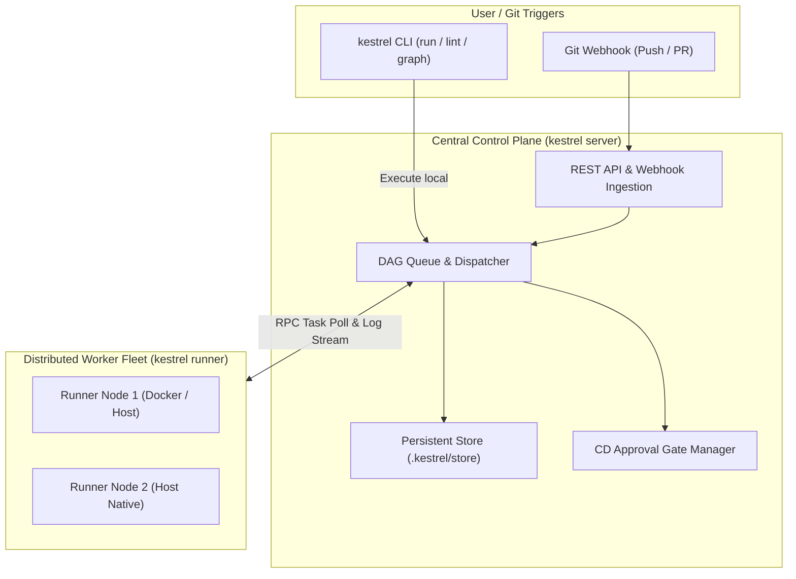

<p align="center">
  
</p>

<h1 align="center">🦅 Kestrel</h1>

<p align="center">
  <strong>A lightweight, razor-sharp cloud-native CI/CD engine built with Go.</strong>
</p>

<p align="center">
  <a href="https://github.com/glorch/Kestrel/actions"></a>
  <a href="https://golang.org"></a>
  <a href="LICENSE"></a>
  <a href="https://github.com/glorch/Kestrel/releases"></a>
</p>

---

## 📖 Introduction

**Kestrel** (红隼) is a modern, fast, and un-bloated CI/CD workflow orchestrator and runner. 

It functions both as an effortless local pipeline executor (run pipelines locally before pushing to Git) and as an enterprise-grade distributed execution system (Server ⇋ Runner architecture with gRPC/HTTP protocol).

---

## ✨ Key Features

- **⚡ Zero Overhead & Instant Startup**: Single static Go binary without heavy runtimes (no Java JVM, no Python virtualenvs).
- **🕸️ DAG Topological Scheduling**: Automatic dependency resolution and parallel stage batching powered by Kahn's algorithm (`needs: [...]`).
- **🔲 Matrix Build Expansion**: Multi-dimensional matrix build matrix (`matrix: { os: [linux, win], go: [1.22, 1.23] }`) with automatic downstream dependency rewiring and variable substitution.
- **🔀 Conditional Execution (`if: ...`)**: Support for `always()`, `success()`, `failure()`, and environment expressions (`${{ env.BRANCH == 'main' }}`).
- **🐳 Dual Runtime Drivers**:
  - **Docker Engine**: Isolated, reproducible container execution via native Docker SDK with automatic bind-mount workspace.
  - **Host / Shell**: Native execution across Linux, macOS, and Windows PowerShell for maximum raw speed.
- **🛡️ DevSecOps & Supply Chain Security**:
  - **Secrets Log Masking**: Automatic real-time redaction of sensitive credentials, passwords, and tokens (`***`) from stdout/stderr.
  - **CycloneDX 1.5 SBOM**: Automated Software Bill of Materials generation (`kestrel sbom`).
  - **Security Gate Policy**: Threshold enforcement on Critical/High vulnerabilities.
- **🚦 CD Environment Governance & Manual Approval Gates**:
  - Protects production environments by pausing pipelines at approval gates (`kestrel approvals list / approve`).
- **🌐 Distributed Server ⇋ Runner Fleet**:
  - Central control plane (`kestrel server start`) with REST API, Webhooks, and task dispatching queue.
  - Distributed runner daemon (`kestrel runner start`) with heartbeat, task polling, and real-time streaming logs.
- **📦 Artifact Collection & Run History**: Automatic file archiving and persistent run history (`kestrel runs list`).
- **🔍 CLI Toolchain**:
  - `kestrel run`: Execute pipelines locally or in CI environments.
  - `kestrel lint`: Static analysis for YAML syntax, missing dependencies, and dependency cycles.
  - `kestrel graph`: Print ASCII execution flowcharts or export GitHub-compatible Mermaid diagrams.

---

## 🏗️ Architecture



---

## 🚀 Quick Start

### 1. Installation

#### Build from source (requires Go 1.23+):

```bash
git clone git@github.com:glorch/Kestrel.git
cd Kestrel
go build -o bin/kestrel ./cmd/kestrel

# Verify installation
./bin/kestrel version
```

---

### 2. Define a Pipeline (`.kestrel.yaml`)

Create a `.kestrel.yaml` file in your repository:

```yaml
version: "1.0"
name: "my-service-ci"

env:
  ENVIRONMENT: "staging"

jobs:
  lint:
    name: "Code Linter"
    runs-on: "host"
    commands:
      - "echo 'Running linter...'"

  test:
    name: "Unit Tests"
    runs-on: "host"
    needs: [lint]
    matrix:
      go: ["1.22", "1.23"]
    commands:
      - "echo 'Testing with Go ${{ matrix.go }}'"

  deploy:
    name: "Production Deployment"
    runs-on: "host"
    needs: [test]
    environment: "production"
    approval: true # Requires manual approval before execution
    commands:
      - "echo 'Deployed to production!'"
    artifacts:
      paths:
        - "bin/*"
```

---

### 3. CLI Commands Reference

#### Local Execution
```bash
# Run pipeline locally
kestrel run

# Simulate execution (dry run)
kestrel run --dry-run

# Validate configuration
kestrel lint

# Visualize DAG dependency tree (ASCII or Mermaid)
kestrel graph
kestrel graph --format=mermaid
```

#### Distributed Server & Runner
```bash
# Start central server (Port 8080)
kestrel server start --port 8080

# Start a worker runner connecting to server
kestrel runner start --server http://localhost:8080 --tags host,docker --capacity 2
```

#### CD Approval Gates & Security
```bash
# List pending deployment approval gates
kestrel approvals list

# Approve a deployment gate
kestrel approvals approve <gate-id> --approver alice --comment "LGTM"

# Generate CycloneDX 1.5 SBOM
kestrel sbom --out sbom.json

# View past execution runs
kestrel runs list
```

---

## 📁 Repository Structure

```text
Kestrel/
├── cmd/
│   └── kestrel/             # Unified CLI (run, server, runner, approvals, sbom)
├── pkg/
│   ├── artifact/            # Artifact archiving and persistence
│   ├── cd/                  # CD environment governance and manual approval gates
│   ├── dag/                 # Directed Acyclic Graph resolver & visualizers
│   ├── engine/              # Pipeline lifecycle orchestrator
│   ├── executor/            # Execution drivers (Docker & Host)
│   ├── logger/              # Thread-safe terminal stream logger with secrets masking
│   ├── pipeline/            # YAML parser, matrix expansion, and condition evaluator
│   ├── rpc/                 # Server ⇋ Runner distributed RPC protocol
│   ├── runner/              # Distributed runner daemon
│   ├── security/            # Secrets masking, CycloneDX SBOM, and vulnerability gates
│   ├── server/              # Central control plane and task dispatcher
│   ├── store/               # In-memory and persistent file run storage
│   ├── version/             # Build and release metadata
│   └── webhook/             # Git Webhook signature verification and path filtering
├── test/
│   └── e2e_integration_test.go # End-to-end distributed integration tests
├── examples/                # Example pipeline configurations
├── docs/                    # Architecture and enterprise specifications
├── .github/workflows/       # GitHub Actions cross-platform CI
└── .kestrel.yaml            # Self-hosting CI configuration
```

---

## 📄 License

This project is licensed under the Apache License 2.0 - see the [LICENSE](LICENSE) file for details.
