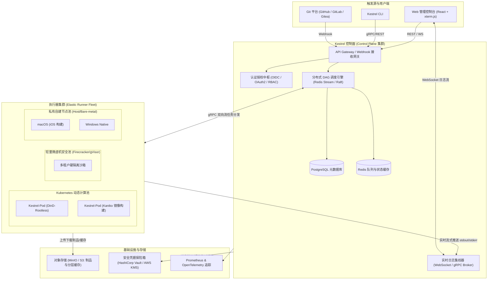

# Kestrel 工业级云原生 CI/CD 平台需求与架构规格书 (PRD / TRD)

> **版本**：v1.0.0-RFC  
> **文档密级**：公开技术规格  
> **面向对象**：核心开发团队、平台架构师、DevOps 专家

---

## 1. 现状差距与工业级演进目标

### 1.1 现状分析 (v0.1.0)
Kestrel 目前具备了完整的本地声明式流水线解析、DAG 拓扑调度（Kahn 算法）、Docker/Host 双执行器与基础产物提取功能。

### 1.2 工业级核心指标定义
工业级 CI/CD 系统不仅需要“能够运行任务”，更核心的是满足 **高可用（HA）、弹性吞吐、强安全沙箱、企业级发布治理、可审计合规**。

---

## 2. 总体架构拓扑 (Industrial Architecture)

工业级 Kestrel 采用完全解耦的分布式架构：

---

## 3. 详细功能需求（Functional Requirements）

### FR-1：分布式控制平面与弹性调度中枢
1. **多副本无状态控制面**：
   - Server 支持水平伸缩，通过数据库悲观锁或 Redis 分布式租约（Redlock）实现多调度节点协作；
   - 调度节点故障转移（Failover）：任务在超时未收到 Runner 心跳时，自动重新入队调度。
2. **事件总线与 Webhook 网关**：
   - 具备幂等性检验（基于 Git `X-Delivery-ID`），防重放攻击；
   - 细粒度事件过滤：PR 打开、标签推送、分支合并、特定文件变更监听（Path Filter）；
   - PR 状态双向回写：自动向 GitHub/GitLab 提交 Status Check（Pending / Success / Failed）。
3. **任务优先权与资源配额控制**：
   - 队列支持按仓库、团队设置并发上限（Concurrency Control），防止某一仓库消耗尽全部 Runner；
   - 支持高优发布插队（Priority Queuing）。

---

### FR-2：工业级 Runner 运行时与安全沙箱架构
1. **Runner 类型矩阵**：
   - **K8s 动态弹性 Runner（主力）**：基于 Kubernetes API，每来一个 Job 动态创建一个 Pod，执行完毕立即彻底销毁，保证 100% 干净环境；
   - **Rootless 无特权容器构建**：废除高风险的宿主机 `docker.sock` 挂载，默认采用 **Kaniko** 或 **Buildah** 编译 Docker 镜像；
   - **微虚机隔离（多租户/SaaS）**：支持对接 Firecracker / gVisor，防止内核级容器逃逸；
   - **自注册私有 Agent**：支持企业内网部署静态 Agent，通过单一出网 gRPC 长连接连回 Server（免内网打洞）。
2. **Matrix 构建矩阵支持**：
   - 声明式展开：如 `matrix: { os: [ubuntu, windows], node: [18, 20] }` 自动生成 4 个并行 Job。

---

### FR-3：零信任凭据保险箱与安全合规
1. **动态注入与凭据作用域隔离**：
   - 凭据按“组织 (Org) -> 项目 (Repo) -> 环境 (Env: Prod/Stage)”分级管理；
   - 支持接入 **HashiCorp Vault** 与云厂商 KMS，采用短期临时 Token 注入。
2. **生产级日志脱敏引擎（Log Masking）**：
   - 实时日志进入流总线前，必须经过基于 Aho-Corasick 或预编译 Regex 的脱敏处理器；
   - 自动扫描所有已加载的 Secret 键值，在控制台和持久化日志中强制替换为 `***`，彻底规避密钥泄露风险。
3. **细粒度 RBAC 与不可篡改审计日志**：
   - 细分角色：Viewer、Developer、Operator、Admin；
   - 记录每一次流水线触发、环境变量修改、审批放行的操作人 IP、时间与详情。

---

### FR-4：环境治理与 CD 持续交付引擎
工业级系统必须跨越“仅能做构建测试”的初级阶段，完整覆盖生产发布生命周期：

1. **环境状态模型（Environment State Tracking）**：
   - 抽象实体：`dev`, `staging`, `production`；
   - 实时呈现当前各环境运行的代码 Commit、发布人、健康检查状态。
2. **人工审批卡点（Approval Gates）**：
   - 支持流水线阻断：在部署生产前挂起任务，向飞书/企业微信/Slack/邮件发送审批卡片；
   - 支持多级审批、指定角色审批（如必须由 QA Team + Tech Lead 共同确认）；
   - 具备审批超时自动驳回策略。
3. **发布策略与自动回滚**：
   - 支持滚动升级、蓝绿切换与金丝雀（Canary）灰度规则；
   - 对接 Prometheus 业务监控指标，若灰度期间 5xx 错误率超过阈值，自动触发回滚指令。

---

### FR-5：软件供应链安全（DevSecOps）
满足 **SLSA Level 3** 标准：
1. **静态代码与依赖安全卡点**：
   - 开箱即用内置 SAST（SonarQube / Semgrep）与依赖脆弱性检查（Trivy / Snyk）；
   - 支持高危漏洞强行中断流水线（Security Gate Block）。
2. **SBOM 生成与签名认证**：
   - 构建阶段自动生成 SPDX / CycloneDX 标准的软件物料清单（SBOM）；
   - 使用 **Cosign / Sigstore** 对构建生成的容器镜像进行数字签名，保证部署到 Kubernetes 时来源绝对可信。

---

### FR-6：企业级缓存与分布式制品库
1. **基于内容寻址的缓存系统（CAS Cache）**：
   - 支持多层 Hash 匹配（如 `hashFiles('go.sum')`），多级回退（Fallback Keys）；
   - 对接 MinIO / S3，支持断点续传与缓存压缩。
2. **Docker 镜像分层缓存加速**：
   - 支持 `--cache-from` 远端 Registry 分层缓存，缩短 80% 的 Docker 构建时间。

---

## 4. 非功能性需求（Non-Functional Requirements - NFR）

| 指标维度 | 目标要求 | 验证手段 |
| :--- | :--- | :--- |
| **调度并发能力** | 单调度实例支持 1,000+ 并发 Job，集群支持 20,000+ 并发 Job | 压力测试模拟高并发任务洪峰 |
| **调度延迟** | 从 Webhook 到达至首个 Agent 收到指令延迟 **< 150ms** | 全链路分布式链路追踪统计 |
| **实时日志吞吐** | 单 Job 支持 10MB/s 瞬时输出，Web 页面渲染无掉帧卡顿 | 压力生成海量日志与前端监控 |
| **高可用 SLA** | 控制面服务可用性达到 **99.95%**，具备跨 AZ 容灾能力 | 模拟节点宕机 Chaos Engineering |
| **数据安全性** | 凭据存储 AES-256-GCM 加密，传输全程 mTLS，日志脱敏率 100% | 静态渗透测试与自动化安全审计 |

---

## 5. Kestrel 工业级产品演进路线图

- **v0.2.0 (分布式基石)**：
  - 拆分 `kestrel-server` 与独立长连接 `kestrel-runner`；
  - 实现基于 gRPC + mTLS 的双向任务推送与流式日志回传；
  - 引入 PostgreSQL 保存持久化流水线记录。
- **v0.3.0 (云原生弹性池与安全)**：
  - 实现 Kubernetes 动态 Pod Runner 驱动；
  - 集成 Vault 凭据管理与流式日志 Aho-Corasick 算法脱敏。
- **v0.4.0 (持续交付与审批控制)**：
  - 引入 Environment 概念与 Web 控制台审批卡点；
  - 接入 Webhook 与 Git 状态双向回写。
- **v1.0.0 (生产就绪 GA)**：
  - 完整 RBAC 权限体系；
  - 软件供应链安全（SBOM + Cosign 镜像签名）；
  - 全链路 OpenTelemetry 追踪与生产级监控大盘。
